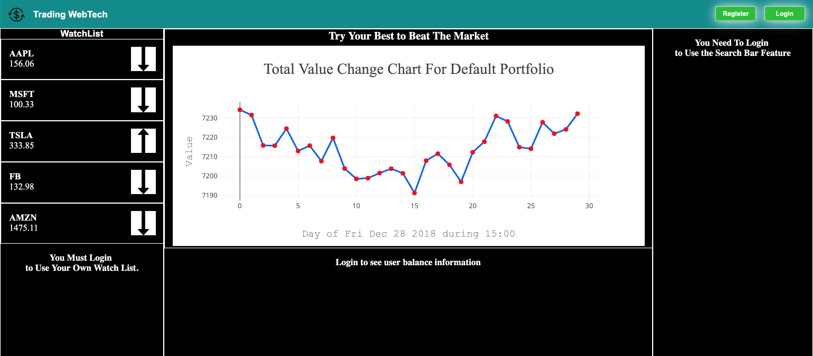
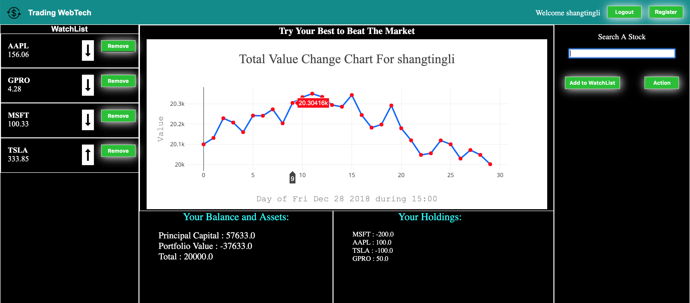

## README (trading-web)

This project help people practice their market views and make them learn how to invest


Languages: **Java, Javascript (JQuery), HTML, CSS, Python**

---
### Main Features

* Log in, Log out, Register
* Search Bar Suggestion
* Add to and Remove from WatchList
* Action to Add Principal Capital or Submit a Long, or Short Transaction
* Updating Information on Watchlist ,Chart, and User Information Every 1 Minute

---
### On Log Out Mode



---
### On Log In mode


---
### Install
* Download the [Project](https://github.com/Shangtingli/trading-web/archive/master.zip)

#### Building The Database
* Change mysql utilities in **db/MySQLDBUtil.java**
* Also if you have a premium AlphaVantage API you can change the API_KEY in **external/AlphaVantageAPI.java**

* To build up the database system required. Run **db/MySQLDBCreation.java** 
* Also To build the ticker information required for suggestion in search bar.
```python3
python3 db/StockCreation/stockDataCreation.py
```

#### Start the WebPage
* Start both the server (Tomcat) and the MySQL database port
* Go to http://localhost:8080/trading-web/

---
### General Information

#### Contributors
* [Shangting Li](https://github.com/shangtingli)
